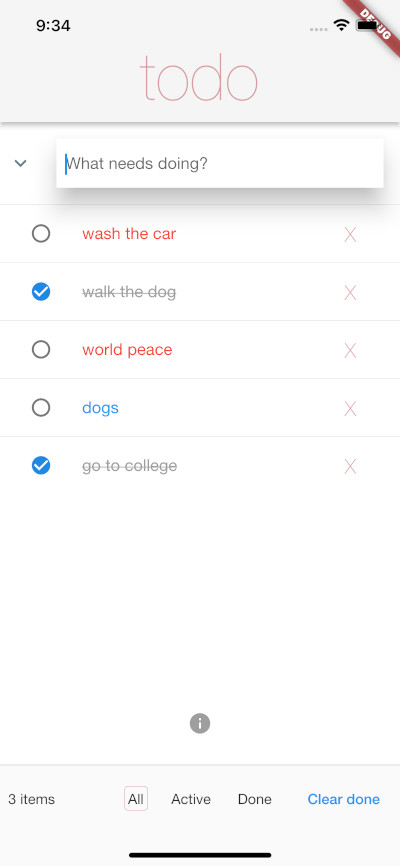

# Flutter/MX

Programming [Flutter](https://flutter.dev/?gclid=CjwKCAjwwdWVBhA4EiwAjcYJEEoxUuE14sd2MGLJW35qeuJynmTRjqpUL3SbIUhOiS4TihjyZ9iTVRoCJkoQAvD_BwE&gclsrc=aw.ds) with [ClojureDart](https://github.com/Tensegritics/ClojureDart) and [Matrix](https://github.com/kennytilton/matrix), a generic, fine-grained, transparent, reactive state manager.

## Documentation
Please see our [WIP Wiki](https://github.com/kennytilton/flutter-mx/wiki), or just ping @kennytilton on the #clojurians or #fluttercommunity Slacks and we can pair to get you rolling.

## Quick Start

If you just want to run the thing...


#### 0. Prepare your Clojure and ClojureDart environments, on Mac OS X

Clojure installation is documented [here](https://clojure.org/guides/install_clojure). tl;dr:
```
brew install clojure/tools/clojure
```

Next, execute the [ClojureDart "Flutter Quick Start"](https://github.com/Tensegritics/ClojureDart/blob/main/doc/flutter-quick-start.md). Help with that can be had in the #ClojureDart channel on the #Clojurians Slack. Or ping @kennytilton on that Slack or the Flutter Community Slack.

#### 1. Clone and initialize this repo
```bash
git clone https://github.com/kennytilton/flutter-mx
cd flutter-mx
clj -M:cljd init
```

#### 2. You now have three delightful options
You can run on an iOS simulator, an iOS device, your browser, or your Mac desktop. Let us explore your options. (Is it not great having this problem?)

##### Device options
We develop on a Mac, and have not explored other platforms. We usually test on an iOS sim, though lately also iPad and iPhone. But we do enjoy developing on a mobile simulator, so we usually launch one. It is not required, but to do the same:
``` bash
open -a Simulator
```
Check the Mac menu bar and it should show the Simulator app, and all sorts of options to choose and control the device. Android SIMs left as an exercise. After changing the options, we will not see a different device until we quite the Simulator app and restart it.

##### Flutter devices
Now to see what devices Flutter thinks are available, in a terminal enter:
``` bash
flutter devices
```
My output as we speak:
``` text

Kenneth’s iPad (mobile)                        • 00008020-0006021A02F1402E            • ios            • iOS 16.5.1 20F75
iPad Pro (12.9-inch) (6th generation) (mobile) • 46B3E45C-52BB-4534-86B4-3BE15D296EF1 • ios            • com.apple.CoreSimulator.SimRuntime.iOS-16-4 (simulator)
macOS (desktop)                                • macos                                • darwin-arm64   • macOS 13.4.1 22F770820d darwin-arm64 (Rosetta)
Chrome (web)                                   • chrome                               • web-javascript • Google Chrome 115.0.5790.114

No wireless devices were found.

• Error: Kenneth’s iPad is busy: Fetching debug symbols for Kenneth’s iPad. Xcode will continue when Kenneth’s iPad is finished. (code -10)
```
n.b. We will ignore the "iPad is busy" error. It seems benign.

OK, made your choice? Make note of the second column, and follow one of the three sets of instructions below.

##### Running on the iOS sim
In a terminal:
```bash
clj -M:cljd flutter -d 46B3E45C-52BB-4534-86B4-3BE15D296EF1 # <---!!!!! change the ID to your ID as shown in the device list
```
After a while you should see the legendary Flutter Counter app on the sim, as shown above.

Note that the build/run command does not return. Hit Control-C when done, or quit the Simulator app. Then continue [below](#3-diagnostics).

#### Running on a phyical iOS device connected via USB cable
Our first task is to get the device capable of running in developer mode:
* Open the device "Settings" app;
* select "Privacy & Security";
* scroll to the end to "Security" options; and
* turn "Developer mode" on.

Now:
```bash
clj -M:cljd flutter -d 00008020-0006021A02F1402E # <---!!!!! change the ID to your ID as shown in the device list
```
Now we have to wait several minutes, not panic when the device puts up a blank screen, and ignore several fatal-sounding errors. Edited output:
```
Launching flutter run -d 00008020-0006021A02F1402E
Launching lib/main.dart on Kenneth’s iPad in debug mode...
...snip...
(lldb) warning: libobjc.A.dylib is being read from process memory. This indicates that LLDB could not find the on-disk shared cache for this device. This will likely reduce debugging performance.
The Dart VM Service was not discovered after 30 seconds. This is taking much longer than expected...
process interrupt
error: Failed to halt process: Halt timed out. State = running
* thread #1, stop reason = signal SIGSTOP
    frame #0: 0x00000001e68b7164 dyld`_dyld_debugger_notification
dyld`:
->  0x1e68b7164 <+0>: ret    
dyld`dyld4::Atlas::Bitmap::Bitmap:
    0x1e68b7168 <+0>: pacibsp 
    0x1e68b716c <+4>: sub    sp, sp, #0x50
    0x1e68b7170 <+8>: stp    x24, x23, [sp, #0x10]
Target 0: (Runner) stopped.
(lldb) 2023-08-07 12:22:43.227037-0400 Runner[2785:2662306] [VERBOSE-2:FlutterDarwinContextMetalImpeller.mm(35)] Using the Impeller rendering backend.
...snip...
A Dart VM Service on Kenneth’s iPad is available at: http://127.0.0.1:65178/sbCSDP_TpSo=/
The Flutter DevTools debugger and profiler on Kenneth’s iPad is available at: http://127.0.0.1:9100?uri=http://127.0.0.1:65178/sbCSDP_TpSo=/
```
We should now see the legendary Flutter Counter app on the device, as shown above.

Note that the build/run command does not return. Hit Control-C when done. Then continue [below](#3-diagnostics).

#### Running on the desktop
In a terminal:
```bash
clj -M:cljd flutter -d macos
```
After a while you should see the legendary Flutter Counter app running in a desktop app! 

Note that the build/run command does not return. Hit Control-C when done, or quit the desktop app. Then continue [below](#3-diagnostics).
#### Running in the Google Chrome browser
In a terminal:
```bash
clj -M:cljd flutter -d chrome
```
After a while you should see the legendary Flutter Counter app running in the Chrome browser! 

Note that the build/run command does not return. Hit Control-C when done, or close the web page. Then continue to [next](#3-diagnostics).

#### Running everywhere
In a terminal:
```bash
open -a Simulator # iff necessary
clj -M:cljd flutter -d all
```
The app should load in the Simulator and a desktop app. 

In a second terminal:
```
clj -M:cljd flutter -d chrome
```


That ^^ is our other demo app, a true "Hello, world."! How cool is that?!

###  3. Diagnostics
We rely exclusively on print debugging, but Flutter offers extensive debugging support you might like. Looking at the terminal window where we started the simulator version, we see:
```
Flutter run key commands.
r Hot reload. 🔥🔥🔥
R Hot restart.
h List all available interactive commands.
d Detach (terminate "flutter run" but leave application running).
c Clear the screen
q Quit (terminate the application on the device).

A Dart VM Service on iPhone 14 Pro Max is available at: http://127.0.0.1:50022/9iEGXsRelsg=/
The Flutter DevTools debugger and profiler on iPhone 14 Pro Max is available at: http://127.0.0.1:9100?uri=http://127.0.0.1:50022/9iEGXsRelsg=/

```
Enter the `Flutter DevTools` URL offered in our browser, `http://127.0.0.1:9100?uri=http://127.0.0.1:50022/9iEGXsRelsg=/`, we see a serious debugging tool!

#### The Counter app, using Flutter/MX
The code for our `Counter` app is [here](https://github.com/kennytilton/flutter-mx/blob/main/src/tiltontec/example/x01_counter.cljd). Yes, just two dozen lines. Lisp can hide a lot.

#### 4. Running other examples.
To try a different example:

0. kill (^C) any `watch` you have running;
1. Switch to the example branch:
```bash
git checkout example
```
2. start another build/watch as explained above; and
3. the latest example app should appear in your chosen device.

#### 5. The Flutter/MX version of TodoMVC
To run the f/mx version of TodoMVC:

0. If not on the example branch, `git checkout example`;
1. Edit `examples/example/driver.cljc`;
2. Change the function `select` to be:
   ```
   (defn select []
      (todo/make-app))
   ```
3. Run as described above.

Here is a TodoMVC screenshot:



Our `TodoMVC` extends the official spec to include a bit of async handling, in the form of an XHR request: we require an async XHR lookup of the text of a ToDo against the [OpenFDA](https://open.fda.gov/) Adverse Events registry. If the lookup succeeds, the text color of the Todo must be set to red. There is no point to this, except as a demonstration of how to make a non-reactive API such as XHR reactive, thus handling async gracefully.

Well, it also demonstrates the power of reactive programming: if we _change_ a ToDo item, a new lookup is triggered automatically, and the text color gets reconsidered automatically once the new lookup responds.

### Workflow
Here is how I work. We will extend this section greatly as we help others get started on Matrix:

* start with the above;
* edit this project in IntelliJ+Cursive, with the Flutter plug-in installed;
* * IMPORTANT: tell IntelliJ to use clj formatting for .cljd files; more Cursive support is on the way;
* after making changes, I save in IntelliJ and check the "build" terminal for errors;
* if all is well, the app will have also done a hot reload. so I check the sim;
* if I do not see my changes, I switch to the launch terminal and hit return, which does a hot restart;
* if I am curious about some CLJD issue, such as how to run the Math `abs` method, I do this:
* * add snippets of code to the main function, after the test suite runner;
* * save;
* * check the "build" for errors;
* * switch to the build terminal and hit Return to trigger a sim reload;
* * check the Flutter console for print output.

Ping @kennytilton on #clojurians or #fluttercommunity Slack for help!
