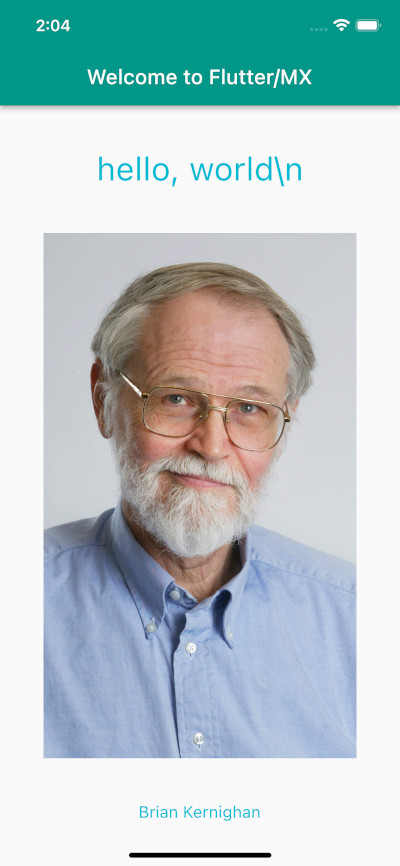

# Flutter/MX

Programming [Flutter](https://flutter.dev/?gclid=CjwKCAjwwdWVBhA4EiwAjcYJEEoxUuE14sd2MGLJW35qeuJynmTRjqpUL3SbIUhOiS4TihjyZ9iTVRoCJkoQAvD_BwE&gclsrc=aw.ds) with [ClojureDart](https://github.com/Tensegritics/ClojureDart) and [Matrix](https://github.com/kennytilton/matrix), a generic, fine-grained, transparent, reactive state manager.

## Documentation
Please see our [WIP Wiki](https://github.com/kennytilton/flutter-mx/wiki), or just ping @kennytilton on the #clojurians or #fluttercommunity Slacks and we can pair to get you rolling.

## Quick Start

If you just want to run the thing...

#### 0. Prepare your ClojureDart working set-up, on Mac OS X

First, complete the [ClojureDart "Flutter Quick Start"](https://github.com/Tensegritics/ClojureDart/blob/main/doc/flutter-quick-start.md). Help with that can be had in the #ClojureDart channel on the #Clojurians Slack. Or ping @kennyilton on that Slack or the Flutter Community Slack.

#### 1. Clone this repo
`git clone https://github.com/kennytilton/flutter-mx`

#### 2. Start a simulator. (Our focus so far has been mobile.)

In a terminal:
* start a sim: `open -a Simulator`

You should see a Simulator appear. I get an iPhone 12 by default. Explore the `open` command for alternatives.

BEWARE! If you forget this step to open a simulator, the next command will run for ages and _open a tab in your browser_. Close everything and start over. 

#### 3. Run the sample app.

In a terminal:
* `cd flutter-mx`, or wherever you cloned it;

Next, we build the app and start a "watch" to rebuild when the source changes.

HEADS UP! This next command does not return. Use Control-C to kill the process when through exploring:

* `clj -M -m cljd.build flutter`

After a few minutes (just the first time, thirty seconds on subsequent start-ups) you should see these last lines of output:
```
An Observatory debugger and profiler on iPhone 12 is available at: http://127.0.0.1:61081/v17dEYvUuuQ=/
The Flutter DevTools debugger and profiler on iPhone 12 is available at: http://127.0.0.1:9100?uri=http://127.0.0.1:61081/v17dEYvUuuQ=/
```
Now check the simulator you opened earlier. You should see our "hello, world" app in the sim:



Mr. Kernighan co-authored "The C Programming Language" with Dennis Ritchie, and contributed the bit on "hello, world".

The code for our `hello-world` is [here](https://github.com/kennytilton/flutter-mx/blob/main/src/tiltontec/example/x00_hello_world.cljd).

#### 4. Running other examples.

To try a different example:
1. Edit [main.cljd](https://github.com/kennytilton/flutter-mx/blob/d6cd6e14027ed8f00a42ca6cc2464e48142922d4/src/tiltontec/main.cljd#L43) and change the namespace `hello` in `(hello/make-app)` to one of the namespaces listed above in the NS requires. Try `xcounter` to see the standard Flutter Counter app, or `todo` to see the [TodoMVC classic](https://github.com/tastejs/todomvc/blob/master/app-spec.md).
2. Save your changes.
3. Now switch back to the "watch" terminal and wait a few seconds until you see that the app has been rebuilt.
4. Now hit RETURN.
5. Check the sim to see the new app.

#### 5. More on the Flutter/MX version of TodoMVC
Here is a TodoMVC medium screenshot:


Our `TodoMVC` extends the official spec to include a bit of async handling, in the form of an XHR request: we require an async XHR lookup of the text of a ToDo against the [OpenFDA](https://open.fda.gov/) Adverse Events registry. If the lookup succeeds, the text color of the Todo must be set to red. There is no point to this, except as a demonstration of how to make a non-reactive API such as XHR reactive, thus handling async gracefully.

Well, it also demonstrates the power of reactive programming: if we _change_ a ToDo item, a new lookup is triggered automatically, and the text color gets reconsidered automatically once the new lookup responds.

### Workflow
Here is how I work. We will extend this section greatly as we help others get started on Matrix:

* start with the above;
* edit this project in IntelliJ+Cursive, with the Flutter plug-in installed;
* * IMPORTANT: tell IntelliJ to use clj formatting for .cljd files; more Cursive support is on the way;
* after making changes, I save in IntelliJ and look at the "build" terminal for errors;
* if all is well, I switch to the terminal and just hit ENTER to see the changed app;
* if I am curious about some CLJD issue, such as how to run the Math `abs` method, I do this:
* * add snippets of code to the main function, after the test suite runner;
* * save;
* * check the "build" for errors;
* * switch to the build terminal and hit Return to trigger a sim reload;
* * check the Flutter console for print output.

Ping @kennytilton on #clojurians or #fluttercommunity Slack for help!
